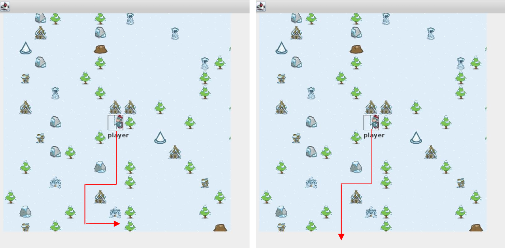
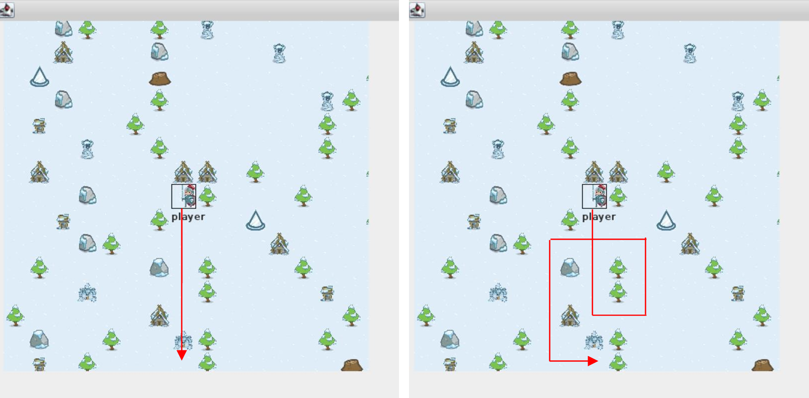
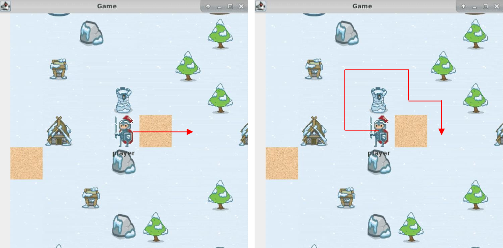

## Overview

The project is a Java-based application that implements a map navigation system with a graphical user interface (GUI) using Java Swing. It features pathfinding algorithms (BFS/DFS), player movement, and interaction with a database to manage map elements like barriers and sand tiles. The goal was to create a functional demo that simulates a player navigating a tiled map while handling scaling, obstacles, and cost-based routing.

## Features

- **GUI with Java Swing**: A 4096x4096 pixel map displayed as 16x16 tiles (256x256 pixels each), with scalable rendering controlled by `jfScaler`.
- **Player Movement**: The player starts at coordinates (7, 8) and can move across the map, with the viewport centered on the player.
- **Pathfinding Algorithms**: Implements BFS (algorithm 1) and DFS (algorithm 0) to navigate from a starting point to a destination, avoiding barriers and previously visited tiles.
- **Cost-Based Navigation**: Sand tiles have variable costs (e.g., 3 or 100), influencing the player's route choice using a `PriorityQueue` with a custom `Comparator`.
- **Dynamic Map Scaling**: Adjusts map and tile sizes based on `jfScaler` (e.g., 1, 2, 4), maintaining functionality across scales.
- **Database Integration**: Connects to a MySQL database to retrieve map data (barriers, sand, routes) for rendering and pathfinding.
- **Multi-threading**: Supports concurrent operations for smoother map updates and player interactions.

## Technical Details

- **Language**: Java
- **Framework**: Java Swing for GUI
- **Database**: MySQL
- **Key Classes**:
  - `DemoFrame.java`: Main GUI frame and scaling logic.
  - `PlayerMovement.java`: Handles player movement and pathfinding.
  - `RouteLinkedList.java`: Manages route storage and traversal.
  - `BlockPriorityQueue.java`: Implements a priority queue for cost-based routing.
  - `DemoDB.java`: Database connection and query handling.
- **Data Structures**:
  - `BlockQueue` and `BlockStack` for managing map blocks.
  - `PriorityQueue` with a custom `Comparator` for path cost calculation.
- **Map Specs**: 4096x4096 pixels, divided into 256x256 tiles, adjustable via `jfScaler`.

## Requirements

- Java Development Kit (JDK) 8 or higher
- MySQL Server (for database connectivity)
- IDE (e.g., IntelliJ IDEA, Eclipse) for compilation and running

## Setup Instructions

1. **Clone the Repository**:
  ```bash
   git clone https://github.com/[your-username]/[your-repo-name].git
   cd [your-repo-name]
  ```

2. **Database Setup**:
- Ensure MySQL is running on `140.127.220.220:3306` (or update `DemoDB.java` with your local database configuration).
- Use the provided credentials: 
  - Database: `checkpoint`
  - Username: `CHECKPOINT`
  - Password: `ckppwd`
- Tables required: `barrier`, `barrier_type`, `map`, `route`, `sand`.

3. **Compile and Run**:
- Compile the project:
  ```bash
  javac *.java
  ```
- Run the demo with parameters (e.g., `map_id=0`, `jfScaler=4`, `milliseconds`, `algorithm=1`):
  ```bash
  java DemoGame 0 4 1
  ```
  
## Usage

- Launch the application with the command above.
- The GUI displays a map centered on the player at (7, 8).
- Click the player to select it (highlighted with a square), then click elsewhere on the map to move using the chosen algorithm.
- Adjust `jfScaler` via command-line arguments to scale the map (1, 2, or 4).
- Sand tiles affect routing based on their cost, visible in the pathfinding behavior.

## Screenshots





## Learning Outcomes

- Refined object-oriented programming concepts in Java.
- Implemented pathfinding algorithms (BFS/DFS) with real-time GUI updates.
- Gained experience with database integration and SQL queries in Java.
- Developed skills in managing scalable GUI applications with Java Swing.
